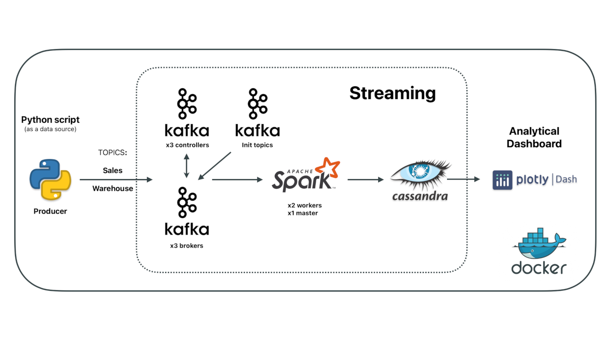

<h1>Sales and Warehouse Live Data Dashboard 📊</h1>

This project is designed to create a live data dashboard for Sales and Warehouse using a modern data streaming and processing architecture. The architecture leverages Apache Kafka for data streaming, Apache Spark for processing, Cassandra for data storage, and Plotly Dash for creating an analytical dashboard. All components are containerized using Docker to ensure easy deployment and scalability.

<h2>Architecture Overview 🔧</h2>

<ul>
    <li><strong>🐍 Python Script (Producer):</strong> Acts as the data source, sending data streams to specific Kafka topics ("Sales" and "Warehouse").</li>
    <li><strong>📦 Kafka Cluster:</strong> Comprises three controllers and three brokers to manage and distribute the data streams. Kafka automatically creates the required topics and ensures data flows correctly through the system.</li>
    <li><strong>⚡ Apache Spark:</strong> Receives and processes the streaming data from Kafka. The Spark cluster consists of two workers and one master node, where Spark submits jobs (on the workers) one after the other, processes the data based on the Kafka topics ("Sales" and "Warehouse"), and inserts the results into Cassandra, acting as a consumer.</li>
    <li><strong>📊 Cassandra:</strong> Stores the processed data from Spark. It offers high availability and scalability, making it ideal for real-time data storage.</li>
    <li><strong>📈 Plotly Dash:</strong> Provides an analytical dashboard for visualizing the data stored in Cassandra, allowing users to interact with and analyze the live data streams. It allows us to switch between Sales and Warehouse live data.</li>
    <li><strong>🐳 Docker:</strong> All components are containerized to ensure consistent environments across different platforms and ease of deployment.</li>
</ul>

<h2>Getting Started</h2>

<h3>Prerequisites</h3>

🐳 Docker and Docker Compose installed on your machine

<h3>Setting Up the Environment</h3>

<ol>
    <li><strong>Clone the repository:</strong>
        <pre><code>git clone git@github.com:NorthBrains/dashboard-1.git</code></pre>
    </li>

    <li><strong>Start the Docker containers:</strong>
        <pre><code>docker-compose up -d</code></pre>
    </li>

    <li><strong>Set Up Cassandra Keyspace and Tables:</strong>
        
After the Cassandra container is up and running, you need to create a keyspace and the required tables. Execute the following command to run the CQL script:

        <pre><code>docker exec -it cassandra_one cqlsh -u cassandra -p cassandra -f /initdb/init.cql</code></pre>
        
This command initializes the database with the required schema, which will be used by the Spark processing and Dash visualization.

    </li>
</ol>

<h3>Accessing the Dashboard</h3>

Once all services are up and running, you can access the Plotly Dash dashboard by navigating to <a href="http://localhost:8900">http://localhost:8900</a> in your web browser.

<h3>Stopping the Environment</h3>

To stop and remove all running containers, execute:

<pre><code>docker-compose down</code></pre>

<h2>Additional Information</h2>

<ul>
    <li><strong>📦 Kafka:</strong> Ensure that the topics are correctly initialized and the data is being streamed to the appropriate topics (<code>Sales</code> and <code>Warehouse</code>).</li>
    <li><strong>⚡ Spark:</strong> The Spark jobs should be configured to read from Kafka, process the data, and write the results to Cassandra.</li>
    <li><strong>📊 Cassandra:</strong> Regularly monitor the storage and performance to ensure that it scales according to the incoming data volume.</li>
    <li><strong>📈 Dash:</strong> Customize the dashboards as needed to include more visualizations or interactive elements that suit your data analysis needs.</li>
</ul>

<h2>Contributions</h2>

Feel free to contribute to this project by submitting issues or pull requests. All contributions are welcome and appreciated!

